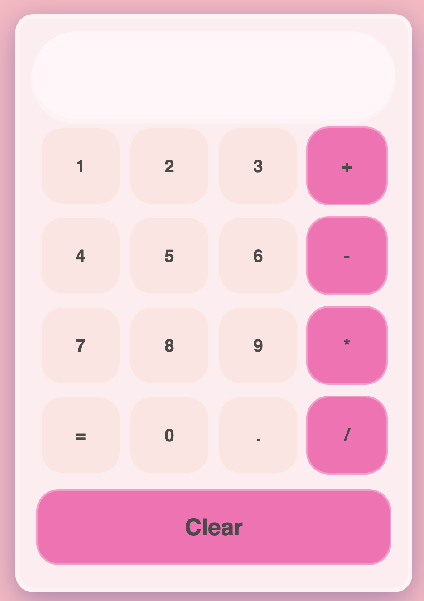

# React + Vite Calculator

<p align="center">
  
</p>

## Overview
A clean and interactive calculator built with **React** and **Vite**. This project focuses on solid state management and a modern user interface, developed as part of my journey into Full Stack development.

[Live Demo](https://jazminadriana.github.io/react-calculator/)

---

## Tech Stack
* **React 18** - UI Library.
* **Vite** - Next-generation frontend tooling.
* **CSS3** - Custom styling with a focus on layout and UX.
* **JavaScript (ES6+)** - Arithmetic logic and state handling.

## Key Features
- **Core Operations:** Robust handling of addition, subtraction, multiplication, and division.
- **Responsive Design:** Fully optimized for mobile, tablet, and desktop screens.
- **Semantic Commits:** Clean Git history following the *Conventional Commits* standard.
- **Modern UI:** Smooth interactions and clear display feedback.

## Installation & Setup
To run this project locally:

1. Clone the repository:
   ```bash
   git clone [https://github.com/jazminadriana/react-calculator.git](https://github.com/jazminadriana/react-calculator.git)